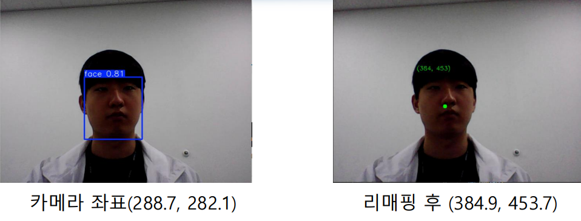
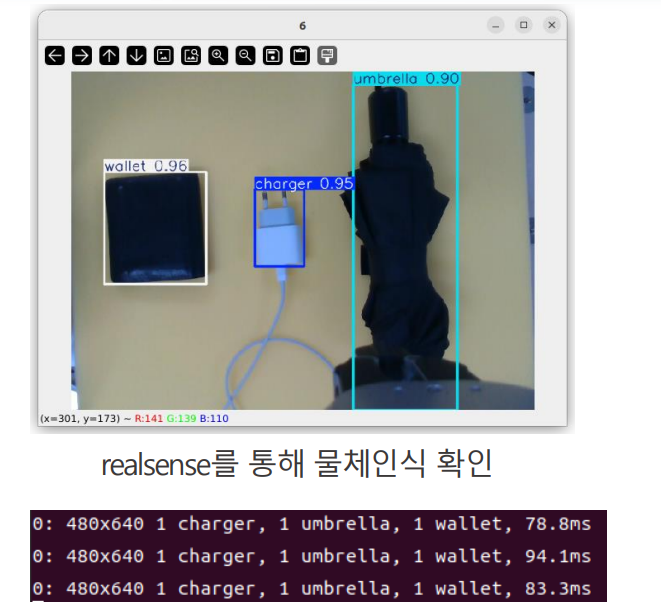
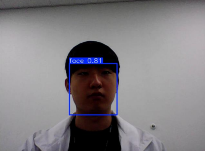
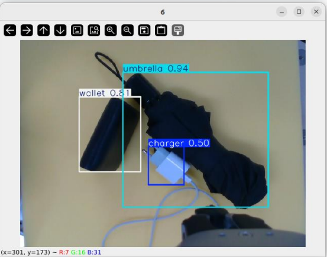

# 🤖 Face-Arm: AI 기반 협동 로봇 작업 어시스턴트

> ROS2, YOLOv8, Force Sensor, 음성인식 기반으로, 사람에게 물건을 전달하고 반납하는 기능을 수행하는 협동 로봇 프로젝트입니다.

---

## 🎥 시연 영상  

---

## 📑 전체 시스탬 구성 코드 저장소  
- GitHub: [DoosanBootcamp Repo](https://github.com/ROKEY-SPARK/DoosanBootcamp.git)  
  > `dsr_rokey/pick_and_place_voice` 경로의 소스를 중심으로 수정 사용
  > 'dsr_rokey/od_msg'의 서비스 통신 사용

---

## 1. 📊 개발 과정

### 프로젝트 배경

- 급격한 고령화에 따른 복지 부담 증가
- 프리미엄 시니어 타운 벤치마킹 → 실사용 가능한 서비스 로봇 개발
- 음성 및 비전 기반의 자율 동작으로 사용자의 요청을 보조

### 📅 작업 일정

| 기간 | 작업 내용 |
|------|-----------|
| 5/23 ~ 5/26 | 프로젝트 주제 선정 및 기획 |
| 5/27 | 서비스 로봇 관련 자료 조사 |
| 5/28 ~ 5/29 | 파트별 코드 개발 (초기 버전) |
| 5/30 | 중간 점검 및 코드 통합 테스트 |
| 6/1 ~ 6/3 | 최적화 및 오류 수정 |
| 6/4 ~ 6/5 | 최종 테스트 및 시연 준비 |
| 총 개발 기간 | 2025.05.23 ~ 06.05 (10일) |

---

### 🧪 사용 환경

---

## 2. 🛠 주요 기능

- 🎯 YOLO 기반 객체 및 얼굴 인식
- 🧭 좌표 추출 후 로봇 이동
- 🖐 Force 센서 기반 물체 수령 감지
- 🗣 음성 명령어 → 키워드 추출 → 동작 연동
- 📂 예외 상황 대응 예외처리 로직 구현

---

## 3. 💡 도전 과제 & 해결

| 문제 | 해결 방법 |
|------|------------|
| 객체 인식 정확도 낮음 | 직접 수집한 데이터셋으로 학습 및 데이터 증강 |
| 음성 인식 오류 | LangChain 기반 키워드 필터링 적용 |
| 좌표 오차 | World 좌표계로 리맵핑 처리 |
| 외력 감지 민감도 | Force 센서 threshold 조절 |

---

## 4. 👥 팀원 역할 분담

| 이름 | 역할 |
|------|------|
| 최정호 (팀장) | 객체 인식 모델 학습 및 발표 |
| 이하빈 | 얼굴 인식 모델 학습 및 좌표 리매핑 |
| 이세현 | 프롬프트 코딩 및 로봇 동작부 코딩 |
| 홍진규 | 예외처리 코드 작성 |

프로젝트는 팀원 전체의 협업을 바탕으로 진행되었으며, 핵심 기능은 역할에 따라 분담하여 개발

---

## 5. 🎯 프로젝트 성과

- ✅ 얼굴 및 물체 탐지 정확도 90% 이상
- ✅ Force 센서 연동한 실제 사용자 반응 감지 성공
- ✅ 음성 명령 → 키워드 추출 → 동작 수행 구조 완성
- ✅ 예외 상황 시 동작 중지 및 알림 처리 구현

---

## 6. 📸 시나리오별 기능 정리

### 1️⃣ “OOO 갖다 줘” 명령

### 2️⃣ “돌아가” 명령

### 3️⃣ “갖다놔 / 내려놔” 명령

### 4️⃣ “여기로 와” 명령

### 5️⃣ 방향 명령 (“오른쪽/왼쪽/앞/뒤/위/아래”)

---

## 7. 📂 핵심 구현 코드

- `yolo.py`  
  → **YOLOv8 기반 객체 감지 및 후처리**  
  → Ultralytics YOLO 모델을 사용하여 이미지 내 객체 바운딩 박스와 신뢰도(score)를 추출합니다

- `face_yolo.py`  
  → **YOLO 기반 얼굴 탐지 및 월드 좌표계 변환**  
  → 얼굴 중심 픽셀 좌표를 추출하고, 이를 월드 좌표계로 리맵핑해 `/remapped_coord` 토픽으로 발행합니다.
  
'

- `object_detection.py`  
  → `yolo.py`에서 모델을 가져와 객체 감지를 수행하고, **중심 좌표 + Depth를 기반으로 3D 위치를 추출**  
  → `/get_3d_position` 서비스 응답 형식으로 ROS 2 서비스로 결과 제공.
'

- `get_keyword.py`  
  → **STT + LangChain 기반 자연어 명령 키워드 추출**  
  → `"로키야 지갑 줘"` → `"wallet"`  
  → ROS 2 `/get_keyword` 서비스 형태로 응답

- `robot_control.py`  
  → **음성으로 추출된 키워드 기반 로봇 동작 실행**  
  → 물체 위치 좌표 획득을 위해 `object_detection.py`의 서비스 호출  
  → 얼굴 이동을 위해 `/remapped_coord` 구독  
  → 그리퍼 제어, 외력 감지 및 예외 처리 포함

---

## 8. 🛡 예외 처리 로직

| 조건 | 처리 결과 |
|------|-----------|
| 객체 인식 실패 | 5초 이상 미검출 시 정지 |
| 좌표 미수신 | 10초간 좌표 없음 → 동작 중단 |
| 범위 외 좌표 | 0~700 범위 벗어나면 무시 |
| 충돌 감지 | Force 센서 이상 시 정지 |
| 음성 명령 오류 | 작동 중지 및 피드백 |
| 사용자 2명 이상 | 신뢰도 높은 대상 선택 |
| Inverse Kinematics 실패 | 작동 중지 및 로그 저장 |

---

## 9. 🧠 학습 데이터 & 모델 정보

- 👤 Face Detection: Roboflow 기반 4,270장 + 증강

 
- 📦 Object Detection: 직접 촬영한 180장 × 3클래스

 
- 📈 학습 비율: Train 70% / Val 20% / Test 10%
- 📦 Augmentation 기법: 반전, 확대, 채도·밝기 조절, blur 등
- 최종 YOLOv8 모델 정확도: 약 90% 이상

---

## 10. 📈 개인적 성찰 및 배운 점

- YOLOv8 학습/튜닝 및 실전 적용 경험
- ROS 2 노드 간 통신 및 비동기 구조 설계 실습
- Force 센서 활용한 사용자 반응 처리 로직 설계
- 팀원 간 역할 분담 및 Git 기반 협업 경험
---

## 11. 🚀 향후 개선 아이디어

- 📶 MQTT 또는 WiFi 기반 다로봇 연동 확장
- 🧭 PID 기반 이동 제어 보완
- 🧠 대화형 AI 음성 응답 시스템 연동
- 📱 모바일 GUI 연동 및 음성 제어 인터페이스 개발

---

## 🧩 시스템 아키텍처

---

> 본 프로젝트는 고령화 사회 대응을 위한 생활 보조 협동 로봇의 가능성을 보여주는 데 집중했으며, 컴퓨터 비전, 음성 인식, 외력 감지 기술을 통합하여 실사용 가능한 스마트 로봇 시스템을 구현하였습니다.
